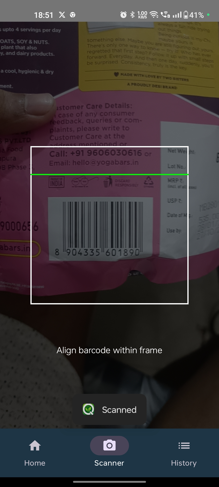
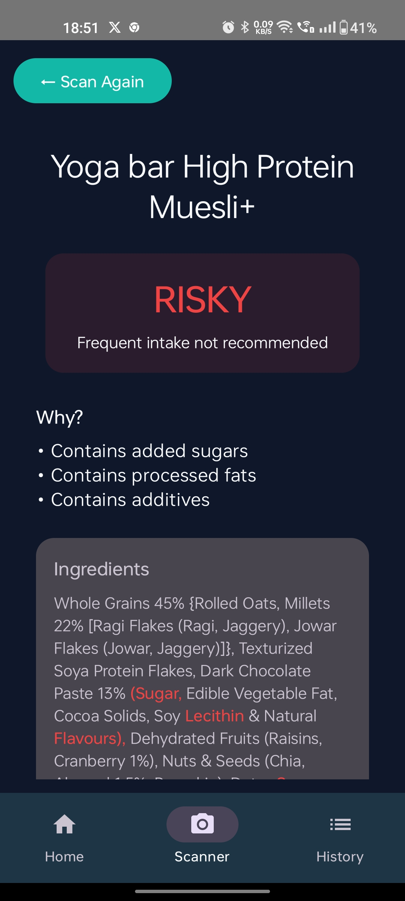
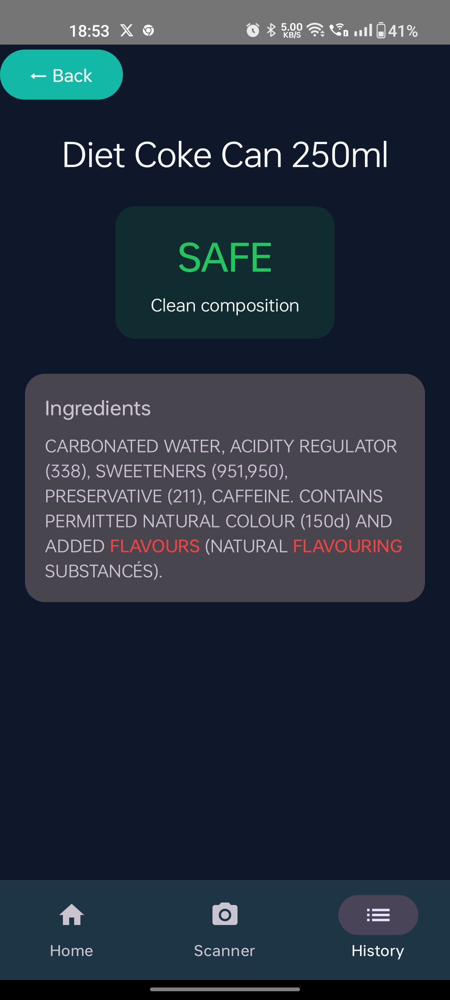
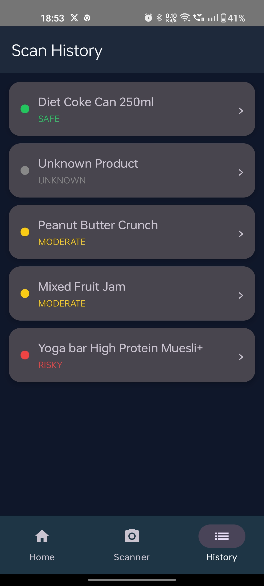
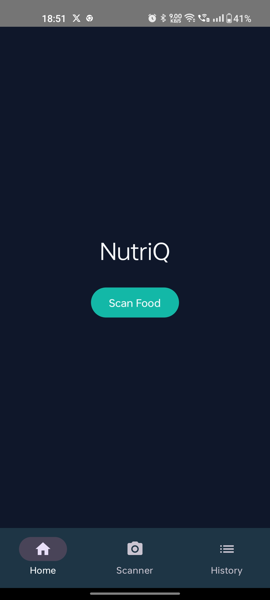

<div align="center">

# 🟢 NutriQ
### Scan. Analyze. Decide.


> *You're not just eating food — you're consuming consequences.*

</div>

---

## 📸 Screenshots

| Scanner | RISKY Result | SAFE Result |
|---|---|---|
|  |  |  |

| History | Home |
|---|---|
|  |  |

---

## 📌 What is NutriQ?

Most people don't read food labels.

NutriQ answers one question the moment you scan a barcode:

> **"What will this food do to me?"**

Point your camera at any packaged food. NutriQ parses the
ingredient list, detects hidden sugars, processed fats, and
additives — then classifies the product instantly:
🟢 SAFE       Clean ingredients, no detected risk factors
🟡 MODERATE   Some concerning ingredients, eat with awareness
🔴 RISKY      Hidden sugars / processed fats / additives detected

Not just a classification — a reason. Every result shows
exactly which ingredients triggered the verdict.

---

## ✨ Features

### 🔍 Scanner System
- CameraX powered live barcode scanning
- ML Kit barcode detection
- Single-scan locking — prevents duplicate scans
- Visual feedback — toast + green flash on successful scan
- Smooth animated transition to result screen

### 🧪 Food Analysis Engine
- Ingredient list parsing from Open Food Facts API
- Detection of hidden sugars — syrup, maltodextrin, dextrose
- Detection of processed fats — palm oil, hydrogenated vegetable fat
- Detection of additives — artificial flavours, emulsifiers, preservatives
- Rule-based risk classification with reason generation

### 🎯 Result Screen
- Risk badge — SAFE / MODERATE / RISKY with color coding
- Highlighted harmful ingredients — not just a score, specific culprits
- Reason-based explanation — why this classification was given
- Scrollable layout for long ingredient lists
- Clean, centered minimal UI

### 📚 History System
- Room database persistence
- Deduplicated entries — same product updates, not duplicates
- Sorted by latest scan
- Clickable cards — reopen any past result
- Color-coded risk dots for quick visual scanning

### 🎨 UI/UX
- Bottom navigation — Home / Scanner / History
- Animated transitions — scanner to result
- Scan overlay — focus frame + animated scan line
- Empty states for all screens
- Premium card-based layout

---

## 🏗️ Architecture
UI Layer (Jetpack Compose)
↕ StateFlow / Flow
ViewModel Layer
↕
Repository Layer
↕                      ↕
Room Database          Retrofit + Open Food Facts API
(Scan history)         (Ingredient data)
↕
Analysis Engine
(Rule-based classifier)

---

## 🛠️ Tech Stack

| Layer | Technology |
|---|---|
| Language | Kotlin |
| UI | Jetpack Compose |
| Architecture | MVVM + Repository Pattern |
| Dependency Injection | Hilt |
| Database | Room |
| Networking | Retrofit + Coroutines |
| Camera | CameraX |
| Barcode Scanning | ML Kit Barcode Scanning |
| State | StateFlow + Flow |

---

## 🚀 Getting Started

```bash
git clone https://github.com/ParthCh300x/NutriQ.git
```

Open in Android Studio.
Camera permission requested at runtime.
No API key required — uses Open Food Facts public API.

Minimum SDK: 26

---

## 🔮 Roadmap

- [ ] Nutri-Score integration
- [ ] Allergen detection — gluten, lactose, nuts
- [ ] Daily scan limit tracking + intake summary
- [ ] Barcode not found — manual ingredient entry
- [ ] Share result as image
- [ ] Flutter version — cross-platform

---

## 👤 Author

**Parth Chaudhary**
IoT Engineering · IIIT Nagpur
[GitHub](https://github.com/ParthCh300x) ·
[LinkedIn](https://www.linkedin.com/in/parth-chaudhary-615124287/)

---

<div align="center">
<i>Scan it before you eat it.</i>
</div>
